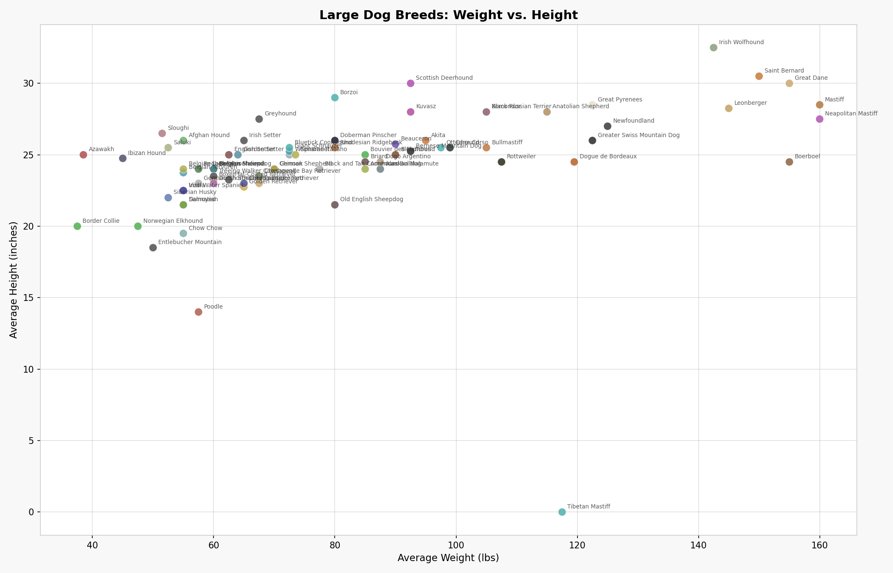
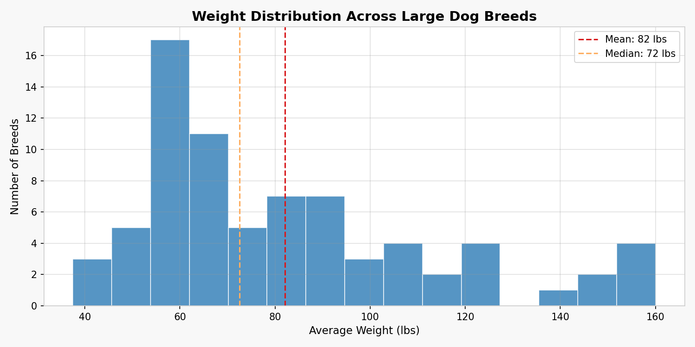
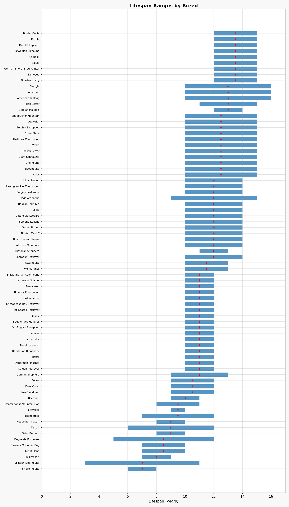
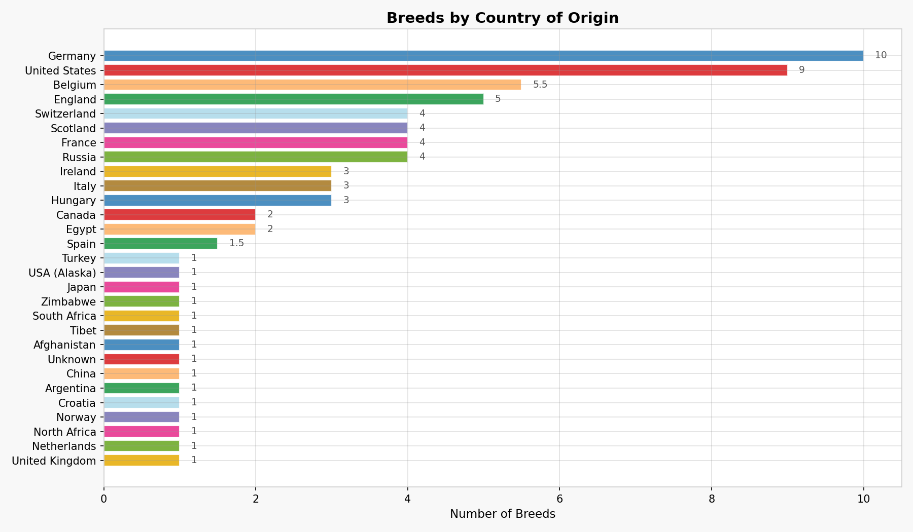
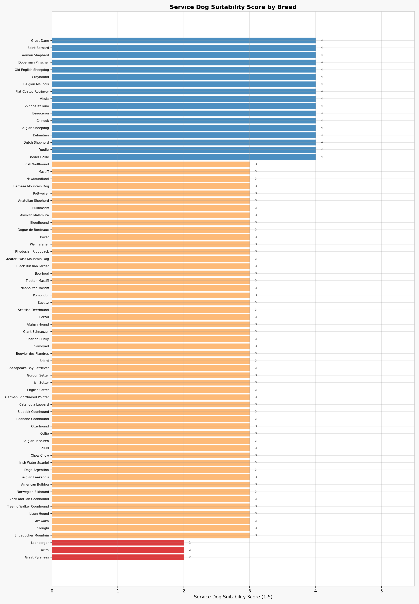
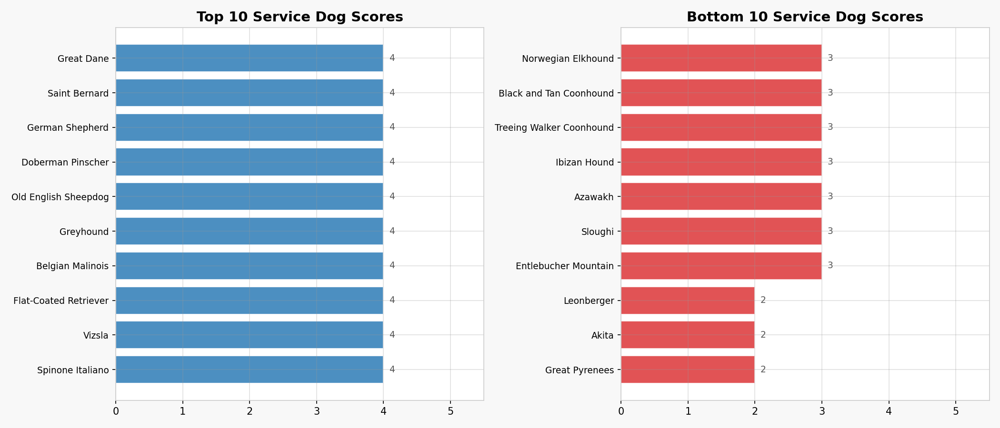
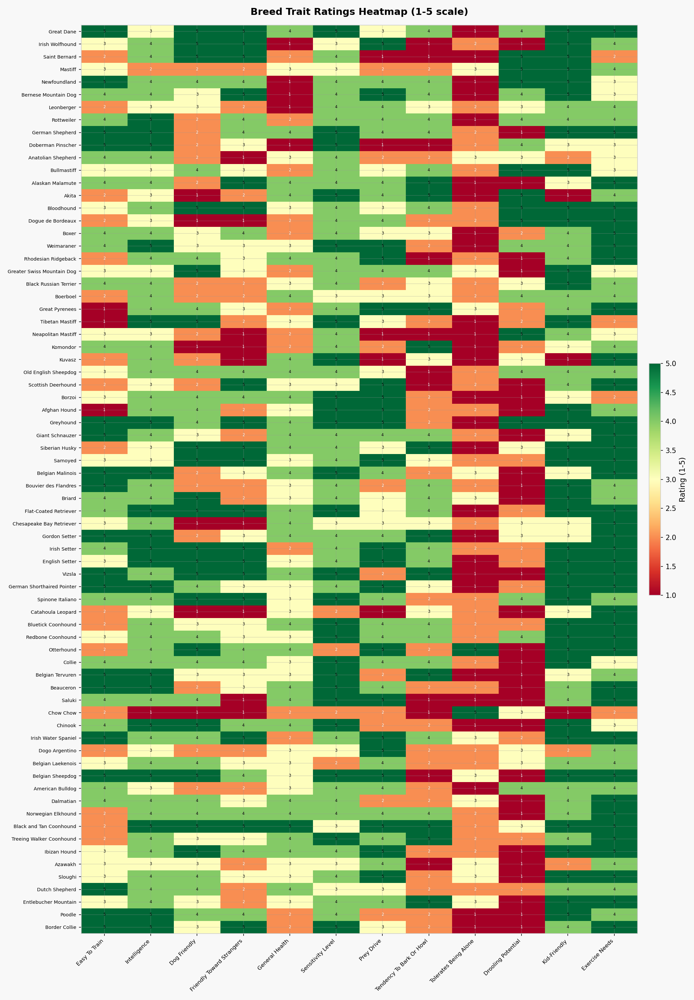
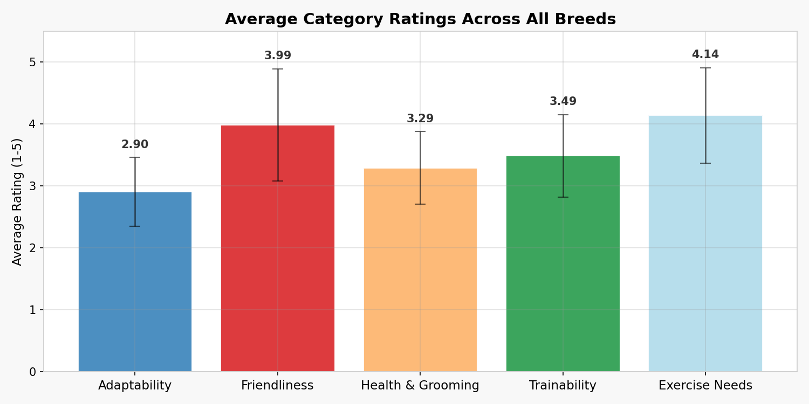
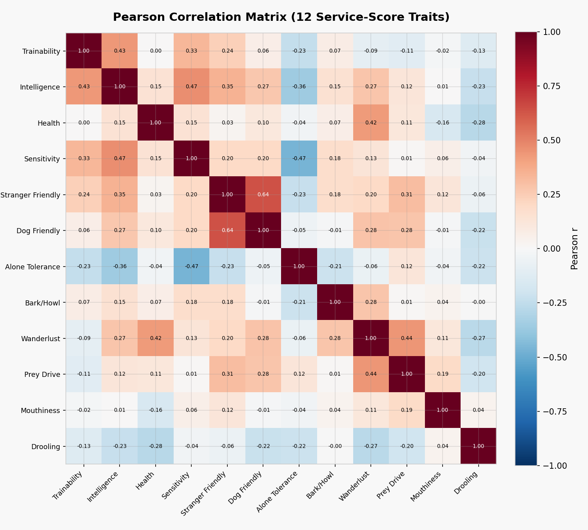

# Large Dog Breeds

**Status**: 🟡 MVP | **Mode**: 🤖 Claude Code | **Updated**: 2026-03-24

**Live app**: [https://k1monfared.github.io/large_dog_breeds/](https://k1monfared.github.io/large_dog_breeds/)

---

An interactive reference and comparison tool for **75 large dog breeds**, combining web-scraped data from [DogTime.com](https://dogtime.com) with a React-based single-page application and a Python data pipeline for scraping, verification, and analysis. The project includes a service-dog suitability scoring system built on correlation analysis of 12 behavioral and physical traits.

## Table of Contents

- [What It Does](#what-it-does)
- [Key Findings](#key-findings)
- [Visualizations](#visualizations)
- [Data Sources and Pipeline](#data-sources-and-pipeline)
- [Service Dog Suitability Score](#service-dog-suitability-score)
- [Run Locally](#run-locally)
- [Adding and Removing Breeds](#adding-and-removing-breeds)
- [Reproducing the Analysis](#reproducing-the-analysis)
- [Project Structure](#project-structure)
- [Requirements](#requirements)

---

## What It Does

**Table view** -- compare all 75 breeds side-by-side with sortable columns:
- Basic stats: weight, height, lifespan, coat, origin, purpose
- Care levels: exercise, grooming, shedding, trainability
- Compatibility: good with kids, good with other dogs
- **DogTime star ratings** -- 25 individual traits plus one overall score per category, grouped into 5 sections (Adaptability, Friendliness, Health & Grooming, Trainability, Exercise). Each column is sortable.
- **Service dog suitability score** -- a computed 1-5 score based on weighted trait analysis

**Card view** -- visual grid with breed photos, key stats, and full rating breakdowns per card.

**Sidebar filters** -- narrow the list by weight, height, lifespan, origin, purpose, exercise level, grooming, shedding, trainability, temperament, coat, and compatibility. Rating filters let you set minimum scores per trait ("show breeds with >= 4 for Kid-Friendly").

**Column visibility toggles** -- show/hide entire rating category groups to focus on what matters.

**Search** -- free-text search across name, origin, purpose, and temperament.

**Add/Remove Breed** -- add any breed from DogTime directly from the browser (requires `server.py`) or from the command line. Removal is also supported via CLI or the web UI.

**CSV Export** -- select rows and export the visible columns to CSV.

---

## Key Findings

- **75 breeds** catalogued with weight, height, lifespan, coat type, origin, and 31 DogTime traits each
- **74 of 75 breeds** have complete star ratings across all 5 DogTime categories
- Breeds originate from **22 countries**, with Germany (10), the United States (9), Belgium (5), and England (5) leading
- Average weight across the dataset is **82 lbs** (median 72 lbs), ranging from 38 lbs to 160 lbs average
- Average lifespan is **11.4 years**, ranging from 7 to 14 years
- **17 breeds** scored a 4 (highest observed) on the service dog suitability scale, including Great Dane, German Shepherd, Doberman Pinscher, Belgian Malinois, Dalmatian, Border Collie, and Poodle
- No predefined trait groups (Cognitive, Public Demeanor, Distraction) met the Pearson |r| >= 0.70 correlation threshold -- all 12 traits are treated as independent standalones in the scoring formula
- Trainability and Exercise Needs show the highest average category ratings across all breeds

---

## Visualizations

### Weight vs. Height

Scatter plot showing the relationship between average weight and average height for all 75 breeds. Each point is colored by the breed's assigned color.



### Weight Distribution

Histogram of average weights across the dataset, with mean and median lines.



### Lifespan Ranges

Horizontal bar chart showing the lifespan range (min to max years) for each breed, sorted by midpoint. Diamond markers indicate the midpoint of each range.



### Breeds by Country of Origin

Distribution of breeds across countries of origin.



### Service Dog Suitability Scores

All 72 scored breeds ranked by their computed service dog suitability score (1-5 scale). Blue bars indicate a score of 4, orange bars 3, and red bars 2.



### Top and Bottom Service Dog Scores

Side-by-side comparison of the 10 highest-scoring and 10 lowest-scoring breeds for service dog suitability.



### Trait Ratings Heatmap

Heatmap of 12 key traits (trainability, intelligence, friendliness, health, prey drive, barking tendency, etc.) across all breeds with complete ratings. Green indicates high scores (5), red indicates low scores (1).



### Average Category Ratings

Bar chart with standard deviation error bars showing the average rating for each of the 5 DogTime categories across all 74 rated breeds.



### Trait Correlation Matrix

Pearson correlation matrix for the 12 traits used in the service dog suitability formula. Computed across 73 breeds with complete data. Most trait pairs show weak correlations, confirming their independence.



---

## Data Sources and Pipeline

All breed data is scraped from [DogTime.com](https://dogtime.com) using Python scripts with `requests` and `BeautifulSoup`. The pipeline consists of four stages:

1. **Verification** (`verify_breeds.py`) -- Fetches each breed's DogTime page and validates weight, height, and lifespan ranges against the JSON data. Corrections are applied automatically with a 10% tolerance, and original values are preserved in a corrections log.

2. **Image download** (`download_images.py`) -- Downloads one representative JPEG per breed from DogTime (via JSON-LD `thumbnailUrl` or `og:image` meta tag) and saves to `images/`.

3. **Rating scraping** (`scrape_ratings.py`) -- Extracts 26 individual trait ratings plus 5 category overall scores from DogTime's `<details>` accordion elements. Uses CSS class counting (`xe-breed-star--selected` spans) for star values. Saves per-breed JSON files to `breed_details/`.

4. **Rating merging** (`merge_ratings.py`) -- Flattens all per-breed rating files into a single `breed_ratings.json` consumed by the React app.

Additionally:
- `scrape_criteria_schema.py` extracts the DogTime trait hierarchy and descriptions (category names, trait names, descriptions) into `criteria_schema.json`. This is breed-agnostic and only needs to run once.
- `scrape_breed.py` scrapes full article content (sections, subsections, bullet lists) into structured JSON.

```bash
# Full pipeline
python verify_breeds.py
python download_images.py
python scrape_ratings.py --all --workers 6
python merge_ratings.py
python compute_service_score.py
```

All scripts accept `--breed 'Name'` to target a single breed and `--dry-run` to preview without writing.

---

## Service Dog Suitability Score

The service dog suitability score is a computed metric (1-5 integer scale) based on 12 behavioral and physical traits from DogTime ratings:

| Trait | Weight | Direction |
|---|---|---|
| Easy To Train | 2.0 | positive |
| Intelligence | 1.5 | positive |
| General Health | 2.0 | positive |
| Sensitivity Level | 1.5 | positive |
| Friendly Toward Strangers | 1.5 | positive |
| Dog Friendly | 1.0 | positive |
| Tolerates Being Alone | 1.0 | positive |
| Tendency To Bark Or Howl | 2.0 | negative |
| Wanderlust Potential | 1.0 | negative |
| Prey Drive | 1.5 | negative |
| Potential For Mouthiness | 0.5 | negative |
| Drooling Potential | 0.5 | negative |

**How it works** (`compute_service_score.py`):
1. Loads `breed_ratings.json` and builds a 12-trait x N-breed matrix
2. Computes the full Pearson correlation matrix across all breeds
3. Checks if predefined trait groups (Cognitive, Public Demeanor, Distraction) are data-confirmed (all within-group pairs |r| >= 0.70). If confirmed, traits in that group are averaged and weighted together; if not, each trait uses its standalone weight.
4. Raw scores are normalized to a 1-5 integer scale
5. Results are written to `service_dog_score` in `large_dog_breeds.json` and the full analysis is saved to `service_score_analysis.json`

In the current dataset (73 breeds with complete data), no predefined groups met the correlation threshold, so all 12 traits are treated independently.

---

## Run Locally

```bash
# With the add-breed API (recommended):
python server.py
# Then open http://localhost:8000

# Without API (read-only):
python -m http.server 8000
```

The server serves static files and provides two API endpoints:
- `POST /api/add-breed` -- `{"name": "Samoyed"}` -- adds a breed
- `POST /api/remove-breed` -- `{"name": "Samoyed"}` -- removes a breed
- `GET /api/breeds` -- returns the current breed data as JSON

---

## Adding and Removing Breeds

**From the command line:**
```bash
python add_breed.py 'Samoyed'              # add a breed
python add_breed.py 'Samoyed' --dry-run    # preview without saving
python add_breed.py 'Samoyed' --remove     # remove a breed
python add_breed.py --refresh-all          # fill gaps in all existing breeds
python batch_add_breeds.py                 # bulk-add from a predefined list
```

**From the browser** (requires `server.py`): click the **+ Add Breed** button in the top-right of the app, type the breed name, and click Add.

The `add_breed.py` script:
1. Resolves the breed name to a DogTime URL (tries slug variations like `samoyed`, `samoyed-dog`)
2. Validates the page title matches the requested breed (prevents partial matches like "Retriever" matching "Labrador Retriever")
3. Extracts weight, height, lifespan ranges from page text using regex patterns
4. Extracts coat type, health notes, and country of origin
5. Downloads the breed photo to `images/`
6. Scrapes all 31 star ratings
7. Appends the entry to `large_dog_breeds.json`
8. Runs `merge_ratings.py` and `compute_service_score.py` to update derived data

If the breed already exists, the script checks for gaps in auto-extractable fields and fills them.

---

## Reproducing the Analysis

```bash
# 1. Install dependencies
pip install requests beautifulsoup4 lxml Pillow matplotlib numpy

# 2. Run the data pipeline (scrapes from DogTime -- requires internet)
python verify_breeds.py
python download_images.py
python scrape_ratings.py --all --workers 6
python merge_ratings.py

# 3. Compute service dog scores
python compute_service_score.py

# 4. Generate visualization charts
python generate_visualizations.py

# 5. Serve the app locally
python server.py
# Open http://localhost:8000
```

---

## Project Structure

| File/Directory | Purpose |
|---|---|
| `index.html` | App entry point -- loads React + Babel from CDN, fetches and compiles the JSX |
| `large_dog_breeds_app.jsx` | Full React app (table view, card view, filters, search, add/remove) |
| `large_dog_breeds.json` | 75 breed entries with stats, slugs, source URLs, and service scores |
| `breed_ratings.json` | Flattened DogTime star ratings for 74 breeds (31 traits each) |
| `criteria_schema.json` | DogTime trait hierarchy with category names, trait names, and descriptions |
| `service_score_analysis.json` | Correlation analysis results and per-breed service scores |
| `images/` | Breed photos (one JPEG per breed) |
| `breed_details/` | Per-breed rating JSON files (74 files) |
| `charts/` | Generated visualization PNGs (9 charts) |
| `server.py` | Local dev server with REST API for add/remove breed |
| `add_breed.py` | CLI tool for adding/removing breeds and filling data gaps |
| `batch_add_breeds.py` | Bulk-add script for a predefined list of 50 breeds |
| `verify_breeds.py` | Validates and corrects breed data against DogTime |
| `download_images.py` | Downloads breed photos from DogTime |
| `scrape_breed.py` | Scrapes full article content into structured JSON |
| `scrape_ratings.py` | Scrapes per-breed star ratings from DogTime |
| `scrape_criteria_schema.py` | Scrapes the DogTime trait schema (one-time, breed-agnostic) |
| `merge_ratings.py` | Merges per-breed rating files into `breed_ratings.json` |
| `compute_service_score.py` | Correlation analysis and service dog score computation |
| `generate_visualizations.py` | Generates all analysis charts in `charts/` |

---

## Requirements

- Python 3.10+
- `requests`, `beautifulsoup4`, `lxml` -- web scraping
- `Pillow` -- image processing
- `matplotlib`, `numpy` -- visualization and analysis

No build step is required for the web app -- it loads React and Babel from CDN and compiles JSX in the browser.
